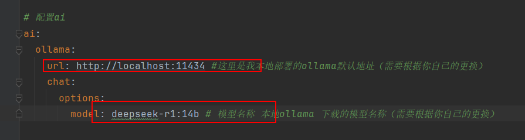

# 基于RAG的生猪健康管理的智慧医药系统

## 项目简介

本项目是一个基于RAG的生猪健康管理的智慧医药系统，集成了AI兽医诊断、疾病管理、药品管理、文章资讯管理等功能模块，旨在通过数字化手段提升生猪养殖的医疗管理水平。系统基于 **SpringBoot3 + RAG +Ollama + Spring AI + DeepSeek + Mysql8.0 + Mybatis-Plus** 技术栈构建，提供智能兽医诊断服务，帮助养殖户或兽医快速识别生猪病情并推荐相应的治疗方案。

> ⚠️ **重要声明**：本项目为个人开发作品，主要用于竞赛、课程设计、毕业设计等学习与研究用途，不具备商用资质与能力。项目中的数据、接口、功能仅供学习交流，请在遵循相关法律法规前提下使用。

## 技术架构

### 核心技术栈

- **后端框架**：SpringBoot 3.3.5、Spring AI、MyBatis Plus
- **前端框架**：Vue3、JavaScript、Vite、Pinia
- **AI模型**：Ollama + DeepSeek
- **数据库**：MySQL 8.0.33
- **缓存系统**：Redis
- **安全框架**：SaToken
- **API文档**：knife4j 4.4.0
- **对象存储**：Minio 8.5.14

### 主要依赖

| 依赖项                         | 版本          | 描述                |
| ------------------------------ | ------------- | ------------------- |
| JDK                            | 21            | Java开发工具包      |
| SpringBoot                     | 3.3.5         | 核心框架            |
| Mysql                          | 8.0.33        | 数据库连接器        |
| Druid                          | 1.2.24        | 数据库连接池        |
| MyBatis Plus                   | 3.5.8         | ORM框架             |
| Hutool                         | 5.7.17        | 工具类库            |
| Lombok                         | 1.18.36       | 简化代码库          |
| OkHttp                         | 4.9.3         | HTTP客户端          |
| Minio                          | 8.5.14        | 对象存储客户端      |
| Spring Security Crypto         | 5.3.8.RELEASE | 安全加密库          |
| Sa-Token Redis                 | 1.40.0        | Sa-Token整合Redis   |
| Sa-Token Spring Boot Starter   | 1.39.0        | Sa-Token权限认证    |
| Sa-Token Core                  | 1.39.0        | Sa-Token核心库      |
| Knife4j                        | 4.4.0         | API文档生成工具     |
| Spring Boot Starter Data Redis | 3.1.0         | Redis支持           |
| Spring Boot Starter Mail       |               | 邮件服务            |
| Apache HttpClient              | 4.5.13        | HTTP客户端          |
| FastJson                       | 2.0.54        | JSON解析库          |

### AI与向量化支持

项目内置 `KnowledgeInitializer` 组件，使用 Spring AI 的 `VectorStore` 对 `resources/knowledge` 目录下的文档进行读取、切分与向量化处理，支持 txt、md、pdf、docx 等多种格式文档。

## 项目实现图

### 小程序运行截图

<div style="display: flex; flex-wrap: wrap;">
    
    
    
    
    
    
    
    
    
    
    
</div>

### Web管理端运行截图

<div style="display: flex; flex-wrap: wrap;">
    
    
    
    
    
    
    
    
    
    
    
    
    
    
    
</div>

### Web用户端运行截图

<div style="display: flex; flex-wrap: wrap;">
    
    
    
    
    
    
    
    
    
    
    
    
    
    
    
    
    
    
</div>

## 核心功能

### 1. **用户管理系统**

- 用户注册、登录（支持账号密码和邮箱验证码两种方式）
- 多角色权限管理（养殖户 / 兽医 / 管理员）
- 个人信息管理

### 2. **智能兽医诊断系统**

- 基于 **Ollama + DeepSeek** 的AI兽医问诊功能
- 支持自然语言描述生猪症状，AI自动识别可能疾病并提供治疗建议
- 疾病相关药品信息智能推荐

### 3. **疾病管理系统**

- 疾病信息查询（症状、治疗方法、相关药品等）
- 疾病分类管理
- 疾病与药品关联管理

### 4. **药品管理系统**

- 药品信息的增删改查
- 药品详细信息展示（功效、品牌、相互作用、禁忌、用法用量等）
- 药品价格管理

### 5. **文章与资讯系统**

- 文章分类管理
- 养殖知识和医疗知识文章发布与浏览
- 新闻资讯管理和展示

### 6. **文件与反馈系统**

- 用户反馈收集与管理
- 系统文件统一管理

### 7. **RAG知识库系统**

- 管理后台"RAG知识库"模块
- 支持上传 txt、md、pdf、doc、docx 格式文件（前后端双重白名单校验）
- 文件自动存储到 `resources/knowledge/` 下的日期目录（跨平台兼容）
- 基于MD5的内容去重机制，避免重复存储
- 支持分页查询、备注编辑、单文件/批量删除
- 可通过 `application.yml` 配置自定义存储路径

## 快速开始

### 1. **环境准备**

- **JDK 21+**
- **MySQL 8+**
- **Redis**
- **Docker**（可选，用于部署 AI 大模型）
- **Maven 3.8+**
- **Node.js 16+**

### 2. **数据库初始化**

在项目的 `doc/SQL` 目录中找到数据库脚本文件，执行以下SQL创建数据库：

```
CREATE DATABASE pig_health_smart_medicine;
```

然后在 `application.yml` 中配置数据库连接信息：


### 3. **其他服务配置**

配置邮箱服务：


配置Redis：


配置Minio对象存储：


配置Ollama AI服务：



### 4. **启动服务**

克隆项目并启动后端服务：

```
git clone https://gitee.com/hsdchb/pig-health-smart-medicine.git
cd pig-health-smart-medicine
mvn clean package
java -jar target/pig-health-smart-medicine.jar
```

启动管理端前端：

```
cd frontend/admin
npm install
npm run dev
```

启动Web用户端前端：

```
cd frontend/web
npm install
npm run dev
```

## 测试账号

```
管理员账号：username: admin | password: 123456
普通用户账号：username: linyi | password: 123456
```

## 数据库设计

### 主要数据表

| 表名               | 说明                                            |
| ------------------ | ----------------------------------------------- |
| `user`             | 用户表，存储用户信息                            |
| `article_types`    | 文章分类表                                      |
| `articles`         | 文章表，存储养殖知识文章                        |
| `conversation`     | AI兽医问诊记录表                                |
| `conversation_session` | AI问诊会话主表                              |
| `feedback`         | 用户反馈表                                      |
| `files`            | 文件存储信息表                                  |
| `history`          | 操作日志记录表                                  |
| `illness`          | 疾病表                                          |
| `illness_kind`     | 疾病种类表                                      |
| `illness_medicine` | 疾病-药品关联表                                 |
| `medicine`         | 药品信息表                                      |
| `news_articles`    | 新闻资讯表                                      |
| `pageview`         | 浏览量统计表                                    |
| `knowledge_file`   | RAG知识库文件表（相对路径、MD5、MIME、备注等）  |

## 数据库：pig_health_smart_medicine

## article_types[文章类型表]


|   字段名    | 类型        | 长度 | 是否为空 | 默认值            | 注释         |
| :---------: | ----------- | ---- | -------- | ----------------- | ------------ |
|   type_id   | int         | --   | NO       | --                | 文章类型ID   |
|  type_name  | varchar(20) | 20   | NO       | --                | 文章类型名称 |
| create_time | datetime    | --   | YES      | CURRENT_TIMESTAMP | 创建时间     |
| update_time | datetime    | --   | YES      | CURRENT_TIMESTAMP | 更新时间     |


## articles[文章表]


|   字段名    | 类型         | 长度  | 是否为空 | 默认值            | 注释                                |
| :---------: | ------------ | ----- | -------- | ----------------- | ----------------------------------- |
|     id      | int          | --    | NO       | --                | 文章ID                              |
|    title    | varchar(255) | 255   | NO       | --                | 文章标题                            |
|   content   | text         | 65535 | NO       | --                | 文章内容                            |
|   author    | varchar(100) | 100   | YES      | --                | 作者                                |
| create_time | datetime     | --    | YES      | CURRENT_TIMESTAMP | 创建时间                            |
| update_time | datetime     | --    | YES      | CURRENT_TIMESTAMP | 更新时间                            |
|   type_id   | int          | --    | YES      | --                | 文章类型ID，外键关联article_types表 |


## conversation[对话表]


|      字段名       | 类型          | 长度  | 是否为空 | 默认值            | 注释             |
| :---------------: | ------------- | ----- | -------- | ----------------- | ---------------- |
|        id         | bigint        | --    | NO       | --                | 主键ID           |
|    session_id     | bigint        | --    | NO       | --                | 会话ID           |
|      user_id      | int           | --    | NO       | --                | 用户ID           |
|    user_input     | text          | 65535 | NO       | --                | 用户输入         |
|    ai_response    | text          | 65535 | NO       | --                | AI回复           |
| conversation_time | datetime      | --    | NO       | CURRENT_TIMESTAMP | 对话时间         |
|    model_name     | varchar(255)  | 255   | YES      | --                | AI模型名称       |
|   response_time   | decimal(10,2) | --    | YES      | --                | AI响应时间（秒） |


## conversation_session[会话主表]


|   字段名    | 类型         | 长度 | 是否为空 | 默认值            | 注释                     |
| :---------: | ------------ | ---- | -------- | ----------------- | ------------------------ |
|     id      | bigint       | --   | NO       | --                | 会话ID                   |
|   user_id   | int          | --   | NO       | --                | 用户ID                   |
|    title    | varchar(255) | 255  | YES      | 新对话            | 会话标题                 |
|   status    | tinyint      | --   | NO       | 1                 | 状态: 1-进行中, 2-已结束 |
| model_name  | varchar(255) | 255  | YES      | --                | AI模型名称               |
| create_time | datetime     | --   | NO       | CURRENT_TIMESTAMP | 创建时间                 |
| update_time | datetime     | --   | NO       | CURRENT_TIMESTAMP | 更新时间                 |


## feedback[反馈表]


|   字段名    | 类型         | 长度  | 是否为空 | 默认值            | 注释     |
| :---------: | ------------ | ----- | -------- | ----------------- | -------- |
|     id      | int          | --    | NO       | --                | 主键ID   |
|    name     | varchar(11)  | 11    | YES      | --                | 反馈用户 |
|    email    | varchar(255) | 255   | YES      | --                | 邮箱地址 |
|    title    | varchar(255) | 255   | YES      | --                | 反馈标题 |
|   content   | text         | 65535 | YES      | --                | 反馈内容 |
| create_time | datetime     | --    | YES      | CURRENT_TIMESTAMP | 创建时间 |
| update_time | datetime     | --    | YES      | CURRENT_TIMESTAMP | 更新时间 |


## files[文件信息表]


|    字段名    | 类型         | 长度 | 是否为空 | 默认值            | 注释                    |
| :----------: | ------------ | ---- | -------- | ----------------- | ----------------------- |
|      id      | int          | --   | NO       | --                | 主键id                  |
|  file_name   | varchar(255) | 255  | NO       | --                | 文件名                  |
|  file_path   | varchar(255) | 255  | NO       | --                | 文件在 MinIO 中的路径   |
|  file_size   | bigint       | --   | NO       | --                | 文件大小，单位为字节    |
| content_type | varchar(100) | 100  | YES      | --                | 文件的 MIME 类型        |
|     url      | varchar(500) | 500  | NO       | --                | 文件的url               |
| upload_time  | timestamp    | --   | YES      | CURRENT_TIMESTAMP | 文件上传时间            |
| bucket_name  | varchar(100) | 100  | NO       | --                | 文件存储的 MinIO 桶名称 |


## history[操作记录表]


|    字段名    | 类型         | 长度 | 是否为空 | 默认值            | 注释                      |
| :----------: | ------------ | ---- | -------- | ----------------- | ------------------------- |
|      id      | int          | --   | NO       | --                | 用户搜索历史主键id        |
|   user_id    | int          | --   | YES      | --                | 用户ID                    |
|   keyword    | varchar(255) | 255  | YES      | --                | 搜索关键字                |
| operate_type | int          | --   | YES      | --                | 类型：1搜索，2科目，3药品 |
| create_time  | datetime     | --   | YES      | CURRENT_TIMESTAMP | 创建时间                  |
| update_time  | datetime     | --   | YES      | CURRENT_TIMESTAMP | 更新时间                  |


## illness[疾病表]


|     字段名      | 类型         | 长度     | 是否为空 | 默认值            | 注释       |
| :-------------: | ------------ | -------- | -------- | ----------------- | ---------- |
|       id        | int          | --       | NO       | --                | 疾病id     |
|     kind_id     | int          | --       | YES      | --                | 疾病分类ID |
|  illness_name   | varchar(100) | 100      | YES      | --                | 疾病名字   |
| include_reason  | mediumtext   | 16777215 | YES      | --                | 诱发因素   |
| illness_symptom | mediumtext   | 16777215 | YES      | --                | 疾病症状   |
| special_symptom | mediumtext   | 16777215 | YES      | --                | 特殊症状   |
|   create_time   | datetime     | --       | YES      | CURRENT_TIMESTAMP | 创建时间   |
|   update_time   | datetime     | --       | YES      | CURRENT_TIMESTAMP | 更新时间   |


## illness_kind[疾病种类表]


|   字段名    | 类型         | 长度 | 是否为空 | 默认值            | 注释     |
| :---------: | ------------ | ---- | -------- | ----------------- | -------- |
|     id      | int          | --   | NO       | --                | 主键ID   |
|    name     | varchar(255) | 255  | YES      | --                | 分类名称 |
|    info     | varchar(255) | 255  | YES      | --                | 描述     |
| create_time | datetime     | --   | YES      | CURRENT_TIMESTAMP | 创建时间 |
| update_time | datetime     | --   | YES      | CURRENT_TIMESTAMP | 更新时间 |


## illness_medicine[疾病-药物表]


|   字段名    | 类型     | 长度 | 是否为空 | 默认值            | 注释           |
| :---------: | -------- | ---- | -------- | ----------------- | -------------- |
|     id      | int      | --   | NO       | --                | 病和药品关联id |
| illness_id  | int      | --   | YES      | --                | 病id           |
| medicine_id | int      | --   | YES      | --                | 药品id         |
| create_time | datetime | --   | YES      | CURRENT_TIMESTAMP | 创建时间       |
| update_time | datetime | --   | YES      | CURRENT_TIMESTAMP | 更新时间       |


## knowledge_file[RAG 知识库文件表]


|   字段名    | 类型            | 长度 | 是否为空 | 默认值            | 注释                                  |
| :---------: | --------------- | ---- | -------- | ----------------- | ------------------------------------- |
|     id      | bigint unsigned | --   | NO       | --                | ID                                    |
|  file_name  | varchar(255)    | 255  | NO       | --                | 原始文件名（含后缀）                  |
|  file_path  | varchar(500)    | 500  | NO       | --                | 相对路径：相对于 resources/knowledge/ |
|  file_size  | bigint          | --   | NO       | --                | 单位：字节                            |
|  file_md5   | char(32)        | 32   | NO       | --                | 文件内容 MD5                          |
|  file_type  | varchar(100)    | 100  | NO       | --                | MIME-Type，如 application/pdf         |
|  create_by  | int             | --   | YES      | --                | 上传人                                |
| create_time | datetime        | --   | YES      | CURRENT_TIMESTAMP | 创建时间                              |
| update_time | datetime        | --   | YES      | CURRENT_TIMESTAMP | 修改时间                              |
|   remark    | varchar(1000)   | 1000 | YES      | --                | 备注                                  |


## medicine[药品表]


|     字段名      | 类型          | 长度     | 是否为空 | 默认值            | 注释                            |
| :-------------: | ------------- | -------- | -------- | ----------------- | ------------------------------- |
|       id        | int           | --       | NO       | --                | 药品主键ID                      |
|  medicine_name  | varchar(100)  | 100      | YES      | --                | 药的名字                        |
|     keyword     | varchar(255)  | 255      | YES      | --                | 关键字搜索                      |
| medicine_effect | mediumtext    | 16777215 | YES      | --                | 药的功效                        |
| medicine_brand  | varchar(255)  | 255      | YES      | --                | 药的品牌                        |
|   interaction   | mediumtext    | 16777215 | YES      | --                | 药的相互作用                    |
|      taboo      | mediumtext    | 16777215 | YES      | --                | 禁忌                            |
|     us_age      | mediumtext    | 16777215 | YES      | --                | 用法用量                        |
|  medicine_type  | int           | --       | YES      | --                | 药的类型，0西药，1中药，2中成药 |
|    img_path     | varchar(255)  | 255      | YES      | --                | 相关图片路径                    |
| medicine_price  | decimal(10,2) | --       | YES      | --                | 药的价格                        |
|   create_time   | datetime      | --       | YES      | CURRENT_TIMESTAMP | 创建时间                        |
|   update_time   | datetime      | --       | YES      | CURRENT_TIMESTAMP | 更新时间                        |


## news_articles[新闻资讯表]


|    字段名    | 类型         | 长度  | 是否为空 | 默认值            | 注释                     |
| :----------: | ------------ | ----- | -------- | ----------------- | ------------------------ |
|      id      | int          | --    | NO       | --                | 新闻ID                   |
|     url      | varchar(500) | 500   | YES      | --                | 转载url                  |
|    title     | varchar(255) | 255   | NO       | --                | 新闻标题                 |
|   content    | text         | 65535 | NO       | --                | 新闻内容                 |
|    author    | varchar(100) | 100   | YES      | --                | 作者                     |
| publish_time | timestamp    | --    | YES      | CURRENT_TIMESTAMP | 发布时间，默认为当前时间 |
|    source    | varchar(255) | 255   | YES      | --                | 新闻来源                 |
|   summary    | text         | 65535 | YES      | --                | 新闻摘要                 |
| create_time  | datetime     | --   | YES      | CURRENT_TIMESTAMP | 创建时间                 |
| update_time  | datetime     | --   | YES      | CURRENT_TIMESTAMP | 更新时间                 |


## pageview[浏览量表]


|   字段名   | 类型 | 长度 | 是否为空 | 默认值 | 注释   |
| :--------: | ---- | ---- | -------- | ------ | ------ |
|     id     | int  | --   | NO       | --     | 主键id |
| pageviews  | int  | --   | YES      | --     | 浏览量 |
| illness_id | int  | --   | YES      | --     | 病的id |


## user[用户表]


|    字段名    | 类型         | 长度 | 是否为空 | 默认值            | 注释                         |
| :----------: | ------------ | ---- | -------- | ----------------- | ---------------------------- |
|      id      | int          | --   | NO       | --                | 用户主键id                   |
| user_account | varchar(255) | 255  | YES      | --                | 用户账号                     |
|  user_name   | varchar(255) | 255  | YES      | --                | 用户的真实名字               |
|   user_pwd   | varchar(255) | 255  | YES      | --                | 用户密码                     |
|   user_age   | int          | --   | YES      | --                | 用户年龄                     |
|   user_sex   | varchar(1)   | 1    | YES      | --                | 用户性别                     |
|  user_email  | varchar(255) | 255  | YES      | --                | 用户邮箱                     |
|   user_tel   | varchar(50)  | 50   | YES      | --                | 手机号                       |
| role_status  | int          | --   | YES      | --                | 角色状态，1管理员，0普通用户 |
|   img_path   | varchar(255) | 255  | YES      | --                | 用户头像                     |
| create_time  | datetime     | --   | YES      | CURRENT_TIMESTAMP | 创建时间                     |
| update_time  | datetime     | --   | YES      | CURRENT_TIMESTAMP | 更新时间                     |

## API 文档

启动后访问 `http://localhost:9999/doc.html` 查看完整 API 文档。（端口以 `application.yml` 为准，默认 9999）

## RAG 知识库使用说明（管理端）

- 菜单：侧边栏进入“RAG 知识库”
- 上传：仅支持 `.txt .md .pdf .doc .docx`；上传后即写入 `resources/knowledge/yyyy/MM/dd` 并入库，重复内容按 MD5 去重
- 查询：按文件名、MIME 类型筛选
- 删除：单删/批量删会同步删除磁盘文件
- 备注：支持编辑保存

可选配置（不是必要）：

```
knowledge:
  storage:
    root: C:/data/knowledge # 自定义绝对路径（不配置则默认源码目录 resources/knowledge）
```

## 未来计划

- **提供疾病流行趋势预测功能**
- **真人兽医到场问诊**

## 免责声明与用途说明

本项目用于学习研究、竞赛、课程设计与毕业设计，不具备商用资质，项目内的示例数据与资源仅作演示用途。

## 贡献指南

欢迎提交 PR 或 Issue 来优化本项目。

## 许可证

本项目采用 MIT 许可证。

---

如有问题，可以有些邮箱联系我，也可以进行交流，项目不足之处，还请多多担待。

> **作者**: linyi
> **邮箱**: jingshuihuayue@qq.com  
> **GitHub**: [PigHealthSmartMedicine](https://github.com/linyshdhhcb/PigHealthSmartMedicine.git)

## 📈 Star History

[](https://star-history.com/#linyshdhhcb/PigHealthSmartMedicine&Date)
